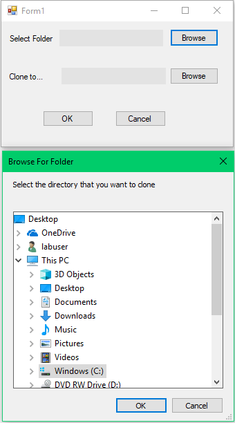

# FolderClone

Objective: Copy a folder with all its nested folders kept but all files deleted

## Requirements

* Windows OS

## common steps

* Clone this repo: `git Clone https://github.com/HumphreyLu6/FolderClone`

* Nevigate to FolderClone/FolderClone/bin/Debug/, open FolderClone.exe

## Interfaces

